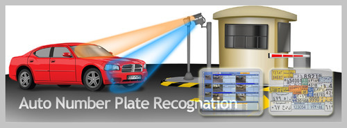

# Automatic-Number-plate-detection-for-Indian-vehicles
5th semester EC351 (Introduction to Algorithms)  project: ANPR on Indian vehicles

Number Plate recognition, also called License Plate realization or recognition using image processing methods is a potential research area in smart cities and the Internet of Things. An exponential increase in the number of vehicles necessitates the use of automated systems to maintain vehicle information for various purposes.

In the proposed algorithm an efficient method for recognition of Indian vehicle number plates has been devised. We are able to deal with noisy, low illuminated, cross angled, non-standard font number plates. This work employs several image processing techniques such as, morphological transformation, Gaussian smoothing, Gaussian thresholding and Sobel edge detection method in the pre-processing stage, afterwhich number plate segmentation, contours are applied by border following and contours are filtered based on character dimensions and spatial localization. Finally we apply Optical Character Recognition (OCR) to recognize the extracted characters. The detected texts are stored in the database, further which they are sorted and made available for searching. 

Refer "Project_Report.pdf" for more details regarding the implementation. 

## References:
* M M Shidore, and S P Narote. (2011) “Number Plate Recognition for Indian Vehicles” International Journal of Computer Science and  Network Security 11 (2): 143-146 
* Sang Kyoon Kim, D. W. Kim and Hang Joon Kim. (1996) “A recognition of vehicle license plate using a genetic algorithm based segmentation,” Proceedings of 3rd IEEE International Conference on Image Processing, Lausanne. 
* https://docs.opencv.org/master/
* https://github.com/anuj-badhwar/Indian-Number-Plate-Recognition-System

